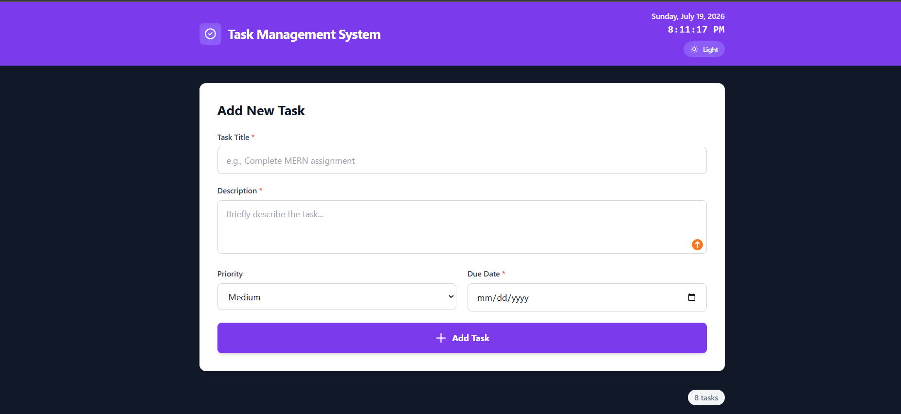
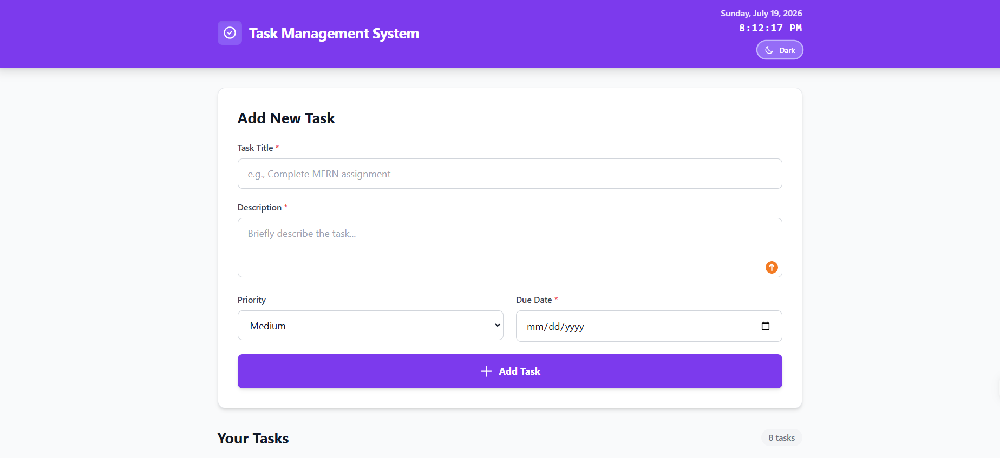
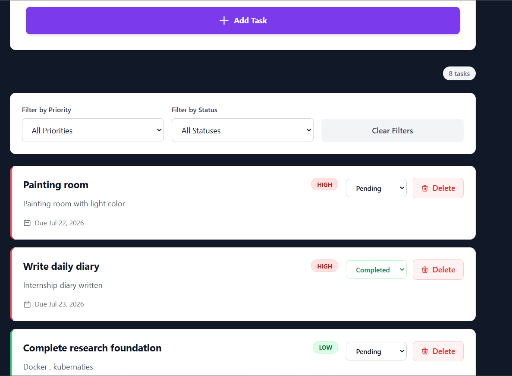
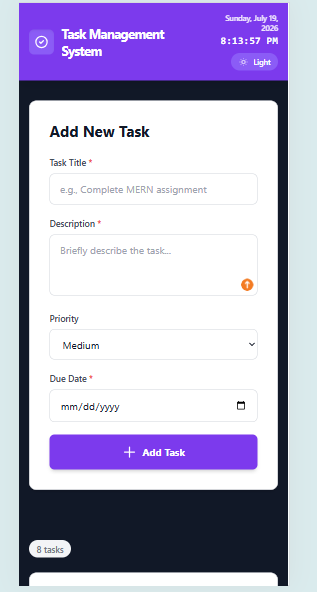

# 📋 Task Management System

A modern, responsive, and full-stack web application built using the MERN (MongoDB, Express, React, Node.js) stack. This application allows users to efficiently create, manage, filter, and track their daily tasks with a beautiful UI featuring both Light and Dark modes.

## ✨ Features

- **CRUD Operations:** Create, Read, Update, and Delete tasks seamlessly
- **Task Attributes:** Add Title, Description, Priority (Low, Medium, High), and Due Date
- **Status Tracking:** Update task status (Pending, In Progress, Completed)
- **Advanced Filtering:** Filter tasks dynamically by Priority and Status
- **Dark/Light Mode:** Toggle between themes with persistent user preference
- **Real-time Clock:** Live date and time display in the navigation bar
- **Input Validation:** Client-side validation with past date restriction
- **Responsive Design:** Fully optimized for desktop, tablet, and mobile devices

## ️ Tech Stack

- **Frontend:** React.js, Vite, Tailwind CSS, Axios
- **Backend:** Node.js, Express.js
- **Database:** MongoDB (via Mongoose)
- **Version Control:** Git & GitHub

## 🚀 Getting Started

### Prerequisites
- Node.js (v14 or higher)
- MongoDB Atlas account (or local MongoDB instance)
- npm or yarn








### Installation

1. **Clone the repository:**
   ```bash
   git clone https://github.com/migarasliit/Task-Management-App.git
   cd Task-Management-App

   Backend Setup:

bash

Create a .env file in the backend folder:

env

Start the backend server:

bash

Frontend Setup:

Open a new terminal and run:

bash


Access the Application:

Open your browser and navigate to http://localhost:5173

 
📝 Project Structure

Key Features Explained

Task Management

Create tasks with title, description, priority, and due date

Update task status with dropdown selection

Delete tasks with confirmation dialog

Real-time updates without page refresh

Filtering System

Filter by Priority: All, High, Medium, Low

Filter by Status: All, Pending, In Progress, Completed

Clear filters button to reset view

Live task count display

Theme Toggle

Smooth transition between light and dark modes

User preference saved in localStorage

Respects system preference on first visit

All components fully themed

🎯 Assignment Requirements Met

✅ Add a task with title, description, priority, and due date

✅ Display all tasks in a clear and organized list

✅ Edit and delete existing tasks

✅ Update task status (Pending, In Progress, Completed)

✅ Filter tasks by priority and status

✅ Validate all required input fields

✅ Create a responsive and user-friendly interface

✅ Use MongoDB database for data storage

👨‍💻 Author

Migara Wijesinghe

Internship Assignment - MERN Stack Development

📄 License

This project is created as part of an internship assignment